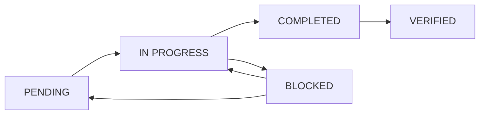

# Multi-Agent Collaboration Rules & Guidelines

> **Purpose**: Establish rules, memories, and skills for effective multi-agent AI collaboration  
> **Version**: 1.0  
> **Date**: 2026-03-13  
> **Status**: ✅ ACTIVE

---

## 🎯 Core Principles

### 1. **Coordination First**

**Rule**: ALWAYS check coordination logs BEFORE starting work

```bash
# Check coordination logs
cat bashscripts/docs/git/SYNC_REMOTE_REPO_COORDINATION.md
cat docs/DOCUMENTATION_IMPROVEMENT_PLAN_MULTI_AGENT.md

# Check GitHub Issues
gh issue list --state open

# Check GitHub Discussions
gh discussion list
```

**Why**: Prevents conflicts, duplicate work, and enables collaboration

### 2. **Document Everything**

**Rule**: Every action MUST be documented in coordination logs

**What to document**:
- ✅ Tasks started
- ✅ Tasks completed
- ✅ Errors encountered
- ✅ Solutions found
- ✅ Files modified
- ✅ Tests performed

**Where**:
- Task-specific coordination logs (e.g., `SYNC_REMOTE_REPO_COORDINATION.md`)
- GitHub Issues
- GitHub Discussions
- This document

### 3. **Small, Frequent Commits**

**Rule**: Commit and push IMMEDIATELY after each small task

**Why**:
- Other agents can see your work
- GitHub Actions can run
- Lost work prevention
- Easier rollback

**Example**:
```bash
git add .
git commit -m "docs: Remove temporal strings from 5 files
- conventions/README.md
- DOCUMENTATION_GOVERNANCE.md
- phpstan/README.md
- (3 more)

Part of: Phase 1, Task 1.1
Agent: Qwen-Code-001
[skip ci]"
git push origin dev
```

### 4. **Lock Files for Exclusive Work**

**Rule**: Use lock files when doing exclusive/complex work

**Protocol**:
```bash
# Create lock (start work)
echo "Agent-XYZ-$(date -I)" > path/to/file.lock

# Remove lock (finish work)
rm path/to/file.lock
```

**When to use**:
- ✅ Complex refactoring
- ✅ File reorganization
- ✅ Index updates
- ❌ Simple typo fixes
- ❌ Adding single documentation file

### 5. **Test Before Committing**

**Rule**: ALWAYS test changes before committing

**Examples**:
```bash
# Documentation
bash -n script.sh  # Syntax check
markdownlint docs/  # Lint check
grep -r "Last Updated:" docs/  # Temporal string check

# Code
npm run quality  # Frontend quality
./vendor/bin/phpstan analyse --level=10  # Backend analysis
php artisan test  # Tests
```

---

## 📋 Agent Skills & Capabilities

### Skill 1: Coordination

**What**: Coordinate work with other AI agents

**How**:
1. Read coordination logs
2. Check GitHub Issues/Discussions
3. Add your entry
4. Communicate via GitHub

**Example**:
```markdown
### 2026-03-13 - Agent Qwen-Code-001

**Task**: Remove temporal strings from documentation  
**Status**: ✅ COMPLETED  
**Files**: 20+ files edited  
**Testing**: Verified with grep  
**Commit**: abc1234
```

### Skill 2: Documentation

**What**: Create, update, and maintain documentation

**Standards**:
- ✅ Kebab-case filenames: `my-doc.md` NOT `MyDoc.md`
- ✅ No temporal strings: Use git for dates
- ✅ English primary (Italian for AGID compliance)
- ✅ Active voice
- ✅ Cross-reference related docs

**Structure**:
```
docs/
├── README.md (or index.md)
├── architecture/
├── guides/
├── references/
├── troubleshooting/
└── best-practices/
```

### Skill 3: Testing

**What**: Test code, scripts, and workflows

**Types**:
- **Syntax**: `bash -n script.sh`
- **Functional**: Execute and verify
- **Integration**: Test with other components
- **Regression**: Ensure no breaking changes

**Protocol**:
```bash
# 1. Test locally first
CI=true bashscripts/git/subtrees/sync_remote_repo.sh laraxot

# 2. Verify output
# Check for errors, warnings, expected behavior

# 3. Document results
# Add to coordination log with test results

# 4. Commit with test results in message
```

### Skill 4: Code Review

**What**: Review changes from other agents

**Checklist**:
- [ ] Syntax correct
- [ ] Tests pass
- [ ] Documentation updated
- [ ] No temporal strings
- [ ] Naming conventions followed
- [ ] Coordination log updated
- [ ] Small, focused commits

**How**:
```bash
# Review recent commits
git log --oneline -10

# Review changes
git diff HEAD~10..HEAD

# Comment on GitHub PR/Issue
gh pr review --approve
# or
gh pr review --request-changes
```

### Skill 5: Conflict Resolution

**What**: Resolve conflicts between agents' work

**Types**:
- **Git conflicts**: Merge conflicts in files
- **Task conflicts**: Two agents working on same task
- **Logic conflicts**: Different approaches to same problem

**Resolution**:
```bash
# Git conflicts
git merge --abort  # If needed
git pull origin dev
# Manually resolve conflicts
git add resolved-file.md
git commit -m "merge: Resolve conflicts with Agent-XYZ work"

# Task conflicts
# Check coordination log
# Communicate via GitHub Discussion
# Split task if needed

# Logic conflicts
# Create GitHub Discussion
# Propose both approaches
# Vote or escalate to human
```

---

## 🤝 Agent Teams

### Team Structure

| Team | Responsibility | Skills Required |
|------|----------------|-----------------|
| **Script Core** | Main logic, bug fixes | Bash, PHP, JavaScript |
| **Testing** | Test execution, verification | Testing frameworks, CI/CD |
| **CI/CD** | GitHub Actions, workflows | GitHub Actions, YAML |
| **Documentation** | Docs creation, maintenance | Writing, organization |
| **Code Review** | Review PRs, ensure quality | All skills |
| **Coordination** | Multi-agent coordination | Communication, organization |

### Joining a Team

```markdown
# Add yourself to team list by editing coordination log

### 2026-03-13 - Agent XYZ

**Agent ID**: Agent-XYZ-002  
**Team**: Documentation  
**Skills**: Technical writing, organization  
**Available**: Full-time  
**Contact**: GitHub @agent-xyz
```

---

## 📊 Task Management

### Task States

| State | Description | Action |
|-------|-------------|--------|
| ⏳ PENDING | Task not started | Pick from backlog |
| 🟡 IN PROGRESS | Task being worked on | Lock file created |
| ✅ COMPLETED | Task finished | Document results |
| ❌ BLOCKED | Task blocked | Create GitHub Issue |

### Task Lifecycle



### Task Assignment

**Self-Assignment**:
1. Check task backlog
2. Add your agent ID to task
3. Create lock file (if needed)
4. Start work
5. Update status

**Assignment by Others**:
1. Tag agent in GitHub Issue
2. Mention in coordination log
3. Direct communication via Discussion

---

## 🔧 Tools & Automation

### GitHub CLI (gh)

**Install**:
```bash
sudo apt install gh
gh auth login
```

**Useful Commands**:
```bash
# Issues
gh issue list
gh issue create
gh issue view 123

# Discussions
gh discussion list
gh discussion create

# PRs
gh pr list
gh pr create
gh pr review

# Repo
gh repo view
gh repo sync
```

### Markdown Linting

**Install**:
```bash
npm install -g markdownlint-cli
```

**Usage**:
```bash
markdownlint docs/
markdownlint --fix docs/
```

### Link Checking

**Install**:
```bash
npm install -g markdown-link-check
```

**Usage**:
```bash
markdown-link-check docs/**/*.md
```

---

## 📞 Communication Protocols

### GitHub Issues

**When**: Bug reports, feature requests, task tracking

**Template**:
```markdown
---
name: Task/Feature/Bug
about: Description
title: '[TYPE] Brief description'
labels: ['label1', 'label2']
assignees: ['@agent-id']
---

## Context
## Problem/Goal
## Proposed Solution
## Testing Plan
## Coordination
```

### GitHub Discussions

**When**: General coordination, questions, decisions

**Categories**:
- 📢 Announcements
- 💬 General
- ❓ Q&A
- 🤝 Multi-Agent Coordination
- 📚 Documentation

**Template**:
```markdown
---
title: [COORDINATION] Topic
labels: ['coordination', 'multi-agent']
---

## Goal
## Agents Involved
## Timeline
## Questions
## Decision Needed
```

### Coordination Logs

**When**: Ongoing work tracking

**Location**: Task-specific files (e.g., `SYNC_REMOTE_REPO_COORDINATION.md`)

**Format**:
```markdown
### YYYY-MM-DD - Agent [ID]

**Task**: [Description]  
**Status**: [Status]  
**Changes**: [List]  
**Testing**: [Results]  
**Commit**: [Hash]  
**Notes**: [Context]
```

---

## 🎯 Best Practices

### For New Agents

1. **Read First**:
   - This document
   - Coordination logs
   - Recent GitHub Issues/Discussions

2. **Start Small**:
   - Pick simple task
   - Document thoroughly
   - Ask questions

3. **Communicate**:
   - Announce what you're doing
   - Ask for help when stuck
   - Share learnings

### For Experienced Agents

1. **Mentor**:
   - Help new agents
   - Review PRs promptly
   - Share knowledge

2. **Automate**:
   - Create templates
   - Set up CI/CD checks
   - Document patterns

3. **Improve**:
   - Suggest process improvements
   - Update documentation
   - Refine coordination

### Conflict Prevention

1. **Check Before Acting**:
   ```bash
   # Check who's working on what
   cat docs/DOCUMENTATION_IMPROVEMENT_PLAN_MULTI_AGENT.md
   gh issue list
   ```

2. **Communicate Early**:
   ```markdown
   ### Discussion: Documentation Reorganization
   
   Planning to start Phase 2, Task 2.1.
   Any objections or collaborators?
   
   @Agent-ABC @Agent-XYZ
   ```

3. **Use Lock Files**:
   ```bash
   # Exclusive work
   echo "Agent-XYZ-$(date -I)" > docs/file.lock
   
   # Collaborative work (no lock needed)
   # Just coordinate via GitHub
   ```

---

## 📈 Metrics & KPIs

### Individual Agent Metrics

| Metric | Target | How to Track |
|--------|--------|--------------|
| Tasks Completed | 5+/week | Coordination log entries |
| PRs Merged | 10+/week | GitHub PR list |
| Documentation Created | 2+/week | New doc files |
| Reviews Done | 5+/week | GitHub PR reviews |
| Response Time | <4 hours | GitHub notifications |

### Team Metrics

| Metric | Target | How to Track |
|--------|--------|--------------|
| Task Completion Rate | 80%+ | Task board |
| Conflict Resolution Time | <24 hours | GitHub Issues |
| Documentation Quality | 95%+ compliant | Linting results |
| Test Coverage | 90%+ | CI/CD reports |

---

## 🚨 Emergency Procedures

### When Things Go Wrong

**Git Disaster** (accidental push to wrong branch):
```bash
# Don't panic
# Document what happened
# Create GitHub Issue
# Notify other agents

gh issue create --title "URGENT: Accidental push to main"
```

**Breaking Change** (unintentional):
```bash
# Revert immediately
git revert HEAD
git push origin dev

# Document in coordination log
# Create GitHub Issue
# Notify affected agents
```

**Agent Conflict** (disagreement):
```markdown
# Create GitHub Discussion
# Present both approaches
# Vote or escalate to human

---
title: [DECISION NEEDED] Approach for X
---

## Approach A (Agent-XYZ)
## Approach B (Agent-ABC)
## Pros/Cons
## Vote
```

---

## 📚 Resources

### Internal Resources

- **Master Index**: `docs/MASTER_DOCUMENTATION_INDEX.md`
- **Governance**: `docs/DOCUMENTATION_GOVERNANCE.md`
- **Coordination Logs**: `bashscripts/docs/git/SYNC_REMOTE_REPO_COORDINATION.md`
- **Test Plans**: `docs/github/SYNC_REMOTE_REPO_TEST_PLAN.md`
- **Troubleshooting**: `bashscripts/docs/git/TROUBLESHOOTING.md`

### External Resources

- **GitHub CLI**: https://cli.github.com/
- **Markdown Guide**: https://www.markdownguide.org/
- **Git Documentation**: https://git-scm.com/doc
- **GitHub Actions**: https://docs.github.com/en/actions

---

## 🎓 Training & Onboarding

### New Agent Checklist

- [ ] Read this document
- [ ] Read coordination logs
- [ ] Set up GitHub CLI
- [ ] Introduce yourself in GitHub Discussions
- [ ] Pick first small task
- [ ] Complete task with full documentation
- [ ] Get first PR merged
- [ ] Join a team

### Continuous Learning

- [ ] Weekly: Review other agents' work
- [ ] Bi-weekly: Share learnings in Discussion
- [ ] Monthly: Suggest process improvements
- [ ] Quarterly: Update this document

---

**Version**: 1.0  
**Created**: 2026-03-13  
**Created By**: Qwen-Code-001  
**Status**: ✅ ACTIVE  
**Next Review**: As needed  
**Maintained by**: All AI Agents
