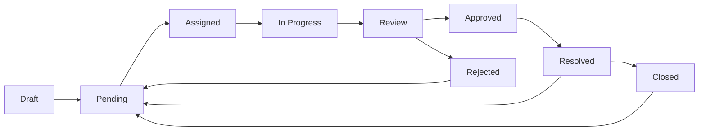

# 🏛️ <nome progetto> - Civic Engagement Platform

> **Piattaforma di segnalazione civica per la gestione intelligente dei disservizi urbani**

---

## 🎯 Project Purpose

**<nome progetto>** è una piattaforma web modulare costruita su Laravel che permette ai cittadini di segnalare problemi urbani (buche, illuminazione rotta, graffiti, rifiuti abbandonati, ecc.) e agli amministratori pubblici di gestirle efficacemente tramite workflow strutturati.

### Vision
Trasformare il rapporto cittadino-amministrazione attraverso:
- 📱 **Accessibilità**: Segnalazioni in 30 secondi da mobile/desktop
- 🔄 **Trasparenza**: Tracking real-time dello stato delle segnalazioni
- 📊 **Data-Driven**: Analytics per decisioni basate su dati reali
- 🤝 **Partecipazione**: Coinvolgimento attivo della comunità

---

## 🏗️ Architecture Overview

### Tech Stack

**Backend**:
- Laravel 12.24.0 + PHP 8.3.20
- SQLite (development) / PostgreSQL (production ready)
- Nwidart Modules + Laraxot Extensions

**Frontend Backoffice**:
- Filament 4.x (Admin Panels)
- Livewire 3.x (Interattività)
- Tailwind CSS 4.0

**Frontend Frontoffice**:
- Laravel Folio (File-based routing)
- Livewire Volt (Single-file components)
- Theme System (Sixteen theme attivo)

**Additional Services**:
- Spatie Media Library (gestione immagini)
- Nominatim OSM (geocoding)
- Laravel Notifications (multi-channel)

---

## 📦 Module Structure

### Core Modules (22 attivi)

#### 1. **<nome progetto>** - Business Logic Core
**Scopo**: Sistema principale di gestione ticket
**Componenti**:
- Models: Ticket, TicketActivity, TicketWorkflowService
- Enums: TicketStatusEnum, TicketPriorityEnum, TicketTypeEnum
- Resources: TicketResource (Filament CRUD)
- Pages: Ticket list, detail, create (Folio)

**Business Logic**:
```
Citizen Reports → Ticket Created → Auto-Geocoding →
Admin Assignment → Status Workflow → Resolution →
Feedback Loop
```

#### 2. **User** - Authentication & Authorization
**Scopo**: Gestione utenti, ruoli, permissions, teams
**Componenti**:
- Models: User, Profile, Team, Role, Permission
- Contracts: UserContract, ProfileContract, TeamContract
- Traits: IsProfileTrait, HasTeams
- Features: OAuth (Socialite), MFA ready

**Roles System**:
- `citizen`: Crea segnalazioni, traccia i propri ticket
- `operator`: Gestisce ticket assegnati, cambia status
- `supervisor`: Oversight, escalation management
- `admin`: Configurazione sistema, analytics
- `super-admin`: Accesso completo

#### 3. **Xot** - Framework Base
**Scopo**: Contracts, traits, utilities condivise
**Componenti**:
- XotBaseModel, XotBaseServiceProvider
- XotData (central configuration)
- Shared contracts (UserContract, ProfileContract)

#### 4. **Notify** - Multi-Channel Notifications
**Scopo**: Email, SMS, Push notifications
**Componenti**:
- GenericNotification (email/sms/database)
- Integration: Laravel Notifications + Twilio ready

#### 5. **Cms** - Content Management
**Scopo**: Pagine statiche, FAQ, guide
**Storage**: JSON-based (lightweight)

#### 6. **Geo** - Geographic Services
**Scopo**: Indirizzi, coordinate, zone geografiche
**Features**: Geocoding integration, spatial queries ready

#### 7. **Media** - File Management
**Scopo**: Upload foto, conversions, CDN ready
**Library**: Spatie Media Library

#### 8. **Activity** - Audit Trail
**Scopo**: Log di tutte le azioni nel sistema
**Integration**: Spatie Activity Log

#### 9. **Rating** - Feedback System
**Scopo**: Valutazione servizi, operatori
**Features**: Star rating, reviews

#### 10. **Comment** - Discussion System
**Scopo**: Commenti su ticket (privati/pubblici)

### Supporting Modules

- **Blog**: Comunicazioni amministrazione
- **Lang**: Multi-language (IT/EN ready)
- **Gdpr**: Privacy compliance
- **Job**: Queue management
- **Tenant**: Multi-tenancy ready
- **Chart**: Visualizzazioni dati
- **AI**: ML features (auto-categorization)
- **Seo**: Meta tags, sitemap
- **UI**: Componenti riusabili
- **Ticket**: Legacy support

---

## 🎯 Business Logic Flow

### 1. Citizen Journey

```
Step 1: Homepage → "Segnala Disservizio"
Step 2: Form compilazione
  - Titolo segnalazione
  - Descrizione dettagliata
  - Categoria (buche, illuminazione, rifiuti, ...)
  - Geolocalizzazione (auto da GPS o manuale)
  - Foto (opzionale, max 5)
Step 3: Submit → Ticket Created
Step 4: Email conferma + Tracking code
Step 5: Dashboard "I miei ticket"
  - Stato: In Valutazione / Assegnata / In Lavorazione / Risolta
  - Timeline eventi
  - Commenti operatore
Step 6: Notifiche su cambio stato
Step 7: Feedback finale (rating service)
```

### 2. Admin Journey

```
Step 1: Login Filament → Dashboard
  - KPI: Ticket aperti, tempo medio risoluzione, heatmap
Step 2: Lista Ticket (filtri: stato, priorità, categoria, zona)
Step 3: Assegnazione a operatore
  - Manuale o automatica (by zona geografica)
Step 4: Operatore prende in carico
  - Cambia status → "In lavorazione"
  - Aggiunge commenti/foto di intervento
Step 5: Completamento
  - Status → "Risolta"
  - Email notifica a cittadino
Step 6: Analytics
  - Report mensili
  - Trend analysis
  - Operator performance
```

### 3. Workflow States



**Status Descriptions**:
- `draft`: Bozza (cittadino non ha inviato)
- `pending`: In attesa assegnazione
- `assigned`: Assegnata a operatore
- `in_progress`: Operatore al lavoro
- `review`: In valutazione supervisor
- `approved`: Approvata per chiusura
- `rejected`: Rifiutata (duplicato/invalido)
- `resolved`: Problema risolto
- `closed`: Ticket chiuso
- `reopened`: Riaperto (problema non risolto)

---

## 🗄️ Data Model

### Core Entities

#### Ticket
```php
id: UUID
slug: string (unique, for URLs)
name: string (titolo)
content: text (descrizione)
status: TicketStatusEnum
priority: TicketPriorityEnum (low/normal/high/urgent)
type: TicketTypeEnum (buche/illuminazione/rifiuti/...)
latitude: float
longitude: float
address: text (geocoded)
owner_id: FK → users (cittadino)
responsible_id: FK → users (operatore assegnato)
created_at, updated_at, deleted_at
created_by, updated_by, deleted_by
```

#### User
```php
id: UUID
name: string
email: string (unique)
password: hashed
email_verified_at: timestamp
current_team_id: FK → teams
profile_photo_path: string
created_at, updated_at
```

#### Profile (extends User data)
```php
id: UUID
user_id: FK → users
type: string (citizen/operator/admin)
first_name, last_name: string
phone: string
bio: text
is_active: boolean
extra: SchemalessAttributes (JSON field)
```

#### TicketActivity (audit log)
```php
id: UUID
ticket_id: FK → tickets
user_id: FK → users
old_status_id: TicketStatusEnum
new_status_id: TicketStatusEnum
notes: text
created_at
```

### Relationships

```
User
  hasOne Profile
  hasMany Tickets (as owner)
  hasMany Tickets (as responsible)
  belongsToMany Teams
  belongsToMany Roles

Ticket
  belongsTo User (owner)
  belongsTo User (responsible)
  hasMany TicketActivities
  hasMany Comments
  morphMany Media (photos)

Team
  belongsTo User (owner)
  belongsToMany Users (members)
```

---

## 🚀 Current Status

### ✅ Completed Features

- ✅ User authentication & authorization (Filament)
- ✅ Ticket CRUD (Filament Resource)
- ✅ Status workflow (TicketWorkflowService)
- ✅ Geolocation (manual entry)
- ✅ Media upload (Spatie)
- ✅ Basic notifications (email)
- ✅ Activity logging
- ✅ Filament admin panels
- ✅ Folio frontend pages
- ✅ Theme system (Sixteen theme)
- ✅ PHPStan level 5 compliance (0 errors)

### 🚧 In Progress

- 🚧 Performance optimization (n+1 queries)
- 🚧 Geocoding job (async)
- 🚧 Advanced analytics dashboard
- 🚧 Mobile PWA

### 📋 Planned Features

**Q1 2026** (Gen-Mar):
- Multi-channel notifications
- Citizen dashboard
- Auto-assignment by zone

**Q2 2026** (Apr-Giu):
- Public REST API
- Advanced analytics
- SLA & escalation system

**Q3 2026** (Lug-Set):
- Voting system
- Multilingual (IT/EN/DE)
- Mobile PWA

**Q4 2026** (Ott-Dic):
- AI auto-categorization
- Predictive maintenance
- Duplicate detection AI

---

## 🎨 UI/UX Design

### Design System: Italia Design System

**Compliance**: AgID guidelines per PA
**Components**: Da `designers.italia.it`
**Theme**: Sixteen (custom implementation)

### Color Palette

```css
/* Primary */
--color-primary: #0066CC (blu italia)
--color-success: #008758 (verde)
--color-warning: #F90 (arancione)
--color-danger: #D32F2F (rosso)

/* Neutrals */
--color-gray-50: #F9FAFB
--color-gray-900: #111827
```

### Typography

- **Headings**: Titillium Web (font AgID)
- **Body**: Roboto
- **Monospace**: Roboto Mono

---

## 📊 Performance Targets

### Current Performance
- **TTFB**: 780ms (list), 1600ms (detail)
- **Query Count**: 87 (list), 23 (detail)
- **Memory**: 45MB (list), 18MB (detail)

### Target Performance (After Optimizations)
- **TTFB**: <120ms (list), <100ms (detail)
- **Query Count**: <5 (list), <3 (detail)
- **Memory**: <8MB (list), <5MB (detail)

**Optimization Strategy**: See `/Modules/<nome progetto>/docs/performance-issues.md`

---

## 🔐 Security

### Authentication
- Laravel Breeze (base)
- Filament Auth (admin)
- OAuth ready (Google, Facebook)
- MFA ready

### Authorization
- Spatie Permissions & Roles
- Policy-based (TicketPolicy)
- Team-based isolation
- GDPR compliant

### Data Protection
- Input sanitization (Laravel validation)
- XSS protection (Blade escaping)
- CSRF tokens
- SQL injection prevention (Eloquent)
- Rate limiting (throttle middleware)

---

## 🧪 Testing Strategy

### Current Coverage: ~40%
### Target Coverage: 85%+

**Test Stack**:
- Pest PHP (feature & unit tests)
- PHPStan Level 5 (static analysis)
- Laravel Pint (code style)

**Critical Paths to Test**:
```php
// Feature Tests
- Ticket creation by citizen
- Ticket assignment by admin
- Status workflow transitions
- Notifications delivery
- File uploads

// Unit Tests
- TicketWorkflowService logic
- Enum validations
- Authorization policies
- Geocoding service
```

---

## 📈 Scalability Plan

### Current Capacity
- Users: 1,000 concurrent
- Tickets: 10,000 total
- Media: 50GB storage

### Target Capacity (1 year)
- Users: 50,000 concurrent
- Tickets: 500,000 total
- Media: 5TB storage (CDN)

**Infrastructure Upgrades**:
1. Database: SQLite → PostgreSQL
2. Cache: File → Redis
3. Queue: Sync → Redis
4. Media: Local → S3 + CloudFront
5. Server: Single → Load Balanced

---

## 🌍 Deployment

### Environments

**Development**:
- URL: http://localhost
- DB: SQLite
- Queue: Sync
- Cache: File

**Staging**:
- URL: https://staging.<nome progetto>.it
- DB: PostgreSQL
- Queue: Redis
- Cache: Redis

**Production**:
- URL: https://<nome progetto>.it
- DB: PostgreSQL (replicated)
- Queue: Redis Cluster
- Cache: Redis Cluster
- CDN: CloudFlare

### CI/CD Pipeline

```yaml
Build → Test (PHPStan + Pest) → Deploy Staging →
Manual Approval → Deploy Production → Monitor
```

---

## 🎓 Developer Onboarding

### Quick Start

```bash
# 1. Clone
git clone [repo-url]
cd laravel

# 2. Install
composer install
npm install

# 3. Setup
cp .env.example .env
php artisan key:generate
php artisan migrate --seed

# 4. Build
npm run build
cd Themes/Sixteen && npm run build && npm run copy

# 5. Serve
php artisan serve
```

### Documentation Links
- Architecture: `/docs/architecture.md`
- API Docs: `/docs/api/`
- Module Docs: `/Modules/{Module}/docs/`
- Theme Docs: `/Themes/Sixteen/docs/`

---

## 📞 Support & Community

### Issue Tracking
- GitHub Issues (bugs)
- GitHub Discussions (features)

### Contributing
See `contributing.md`

### License
MIT (to be confirmed)

---

**Project Created**: September 2024
**Current Version**: 0.9.0 (Beta)
**Next Release**: 1.0.0 (March 2025)
**Maintained by**: Internal Team
