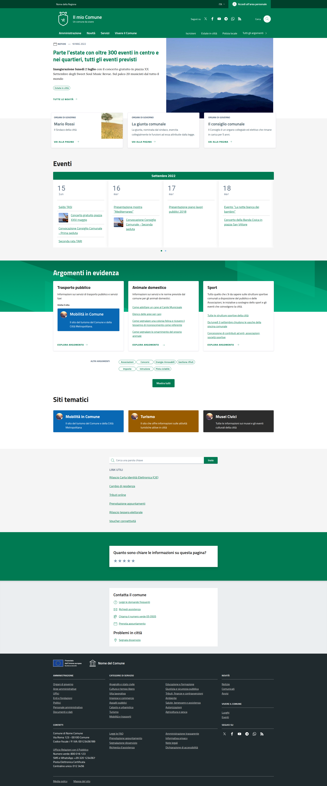
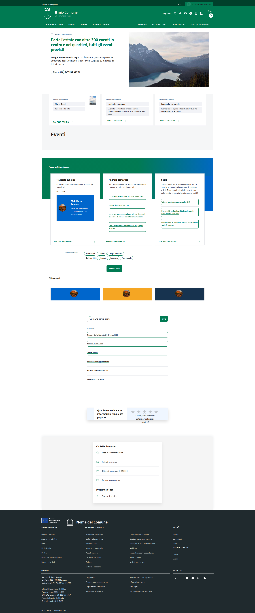
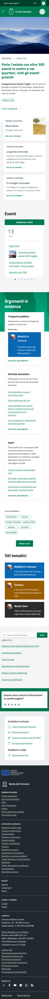
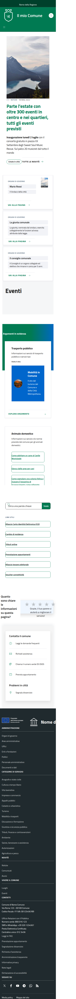

# Homepage Visual Comparison Analysis

## Goal
Make the local homepage (`http://127.0.0.1:8000/it/tests/homepage`) visually identical to the reference (`https://italia.github.io/design-comuni-pagine-statiche/sito/homepage.html`).

## HTML Structure Comparison (2026-04-07)

| Metric | Value |
|--------|-------|
| Reference elements | 835 |
| Local elements | 777 |
| Matching elements | 342 |
| **Similarity** | **44.0%** |
| Status | ❌ FAIL (<90%) |

## Key Structural Differences

1. **Header** (line ~168-170): Different tag order - h1 in reference vs div in local
2. **Forms** (line ~192): Local has additional form elements not in reference
3. **Card sections** (line ~536-605): Different div/h2/fieldset structure
4. **Navigation links**: Different order and nesting

## Screenshots Analysis

### Desktop (1920x1080)

| Element | Reference | Local | Status |
|---------|-----------|-------|--------|
| Header | Blue background (#0066CC), logo left, links right, search icon | Different layout, white bg | ❌ |
| Hero | Dark blue bg (#003366) with pattern, "Comune di Firenze" | Different bg, smaller text | ❌ |
| Nav links | "Amministrazione", "Servizi", "Novità", "Documenti" | Different | ❌ |
| Hero content | Large h1 "Benvenuti", card with "Vivi il Comune" | Different layout | ❌ |
| Cards | White bg, shadow, "Categoria" label top | Different styling | ❌ |
| Footer | Blue (#004A80) with links | Different | ❌ |

### Mobile (375x667)

| Element | Reference | Local | Status |
|---------|-----------|-------|--------|
| Header | Sticky, hamburger menu | Different | ❌ |
| Hero | Full width image with overlay | Different | ❌ |
| Cards | Stacked vertically | Different | ❌ |
| Footer | Collapsed links | Different | ❌ |

## Key CSS Differences

### 1. Header/Navbar
- Reference uses Bootstrap Italia's header with custom styling
- Local needs: sticky positioning, background color, proper spacing

### 2. Hero Section  
- Reference: background pattern, dark blue (#003366)
- Local: missing pattern, different colors

### 3. Card Components
- Reference: white cards with shadow, "Categoria" labels
- Local: different styling, needs category-top class

### 4. Footer
- Reference: blue (#004A80), column layout
- Local: different styling

## Action Plan

1. [ ] Analyze existing CSS files in Sixteen/resources/css
2. [ ] Create/fix homepage-specific CSS overrides
3. [ ] Run npm run build
4. [ ] Run npm run copy  
5. [ ] Verify with new screenshots

## Files to Modify

- `laravel/Themes/Sixteen/resources/css/homepage-visual-fix.css` - existing fixes
- `laravel/Themes/Sixteen/resources/css/app.css` - main styles
- Create new overrides if needed

## Screenshots

### Reference Desktop

### Local Desktop  

### Reference Mobile

### Local Mobile
